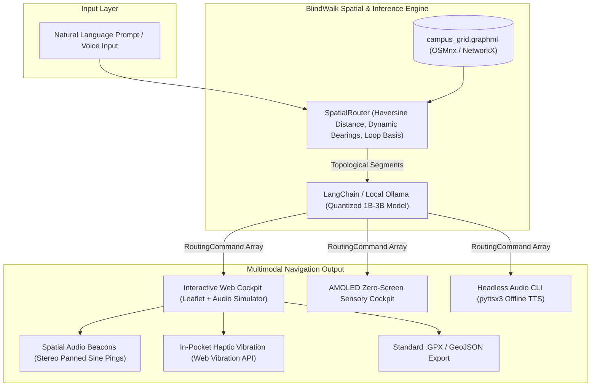

# BlindWalk 🌿
### Air-Gapped Spatial Routing & Screenless Sensory Audio Navigator

[](https://hacktoberfest.com/)
[](LICENSE)
[](https://python.org)
[](https://github.com/)

> **"Closed APIs fail off-grid. BlindWalk utilizes localized OpenStreetMap topology, quantized on-device models, and directional acoustic cues to provide zero-latency pedestrian navigation in zero-signal environments."**


---

## 💡 The Backstory: Why I Built BlindWalk

As a student at **Jain University Global Campus (Kanakapura Road, Karnataka)**, navigating our sprawling campus under the midday sun is an everyday challenge. Between classes, students have to trek across vast open grounds where midday temperatures regularly soar to **34°C–36°C (93°F–97°F)** with blinding sun glare.

Whenever I tried navigating cross-campus, three major issues made standard map apps frustratingly useless:
1. **Commercial maps are car-biased and shade-blind:** Apps like Google Maps persistently route pedestrians down blazing, open asphalt roads where the sun beats down relentlessly. They completely ignore our shaded neem tree corridors, tree-lined quads, and unpaved perimeter trails.
2. **Cellular signal drops off-grid:** As soon as you walk past the academic blocks toward the sports grounds, cricket oval, or perimeter boundaries, 4G/5G signals plummet. Commercial maps freeze into useless blank gray checkerboards while waiting for cloud tile servers.
3. **Screen fixation is dangerous and exclusionary:** Looking down at a smartphone screen under intense sunlight glare while walking on dirt trails is an easy way to trip over tree roots or rocks. More importantly, for blind or visually impaired students and hikers, visual graphical map interfaces are completely inaccessible.

**BlindWalk** was built directly out of this real-world frustration: an **air-gapped spatial routing agent** that loads localized OpenStreetMap topology into an offline NetworkX graph, prioritizes tree canopy coverage and soft dirt paths over hot asphalt, and guides the pedestrian using **directional audio beacons, offline speech synthesis, and in-pocket haptic vibration**—with **zero screen time required**.

---

## 🌟 What You Can Do (Live Features)

🌐 **Live Deployed Web App:** [https://sharan-s-dev.github.io/blind-walk/](https://sharan-s-dev.github.io/blind-walk/)  
*(Open in any desktop or mobile browser — 100% free, zero installation, zero API keys required)*

### 1. Interactive Web Cockpit (`http://localhost:8000` or Live URL)
- **Verified Ground-Truth Campus Topology:** Mapped directly to verified ground features across Jain University Global Campus:
  - 🏛️ **School of Engineering & Technology (SET Dome)** & Academic Quad
  - ⛳ **Jain University Golf Course Shaded Trail**
  - 🍲 **Campus Central Mess & Shaded Neem Walkway**
  - 🏏 **Jain University Cricket Ground & Football Ground**
  - 🏊 **JIRS Swimming Pool & Sports Complex**
  - 🛕 **Jain Temple & Spiritual Garden**
  - 🏟️ **Colloseum Amphitheater Walk**
  - 🔬 **Core Block & Aerospace Lab Walk**
- **Multi-Location Presets & Worldwide Map Search:**
  - Instant presets for **Jain Global Campus**, **IISc Bangalore**, **Cubbon Park Nature Preserve**, **Lalbagh Botanical Garden**, and **Nandi Hills Hiking Reserve**.
  - **Global OpenStreetMap Search:** Search any university, park, or city on Earth (e.g., *"Central Park New York"*, *"Lodhi Garden Delhi"*) to dynamically synthesize a shaded pedestrian loop anywhere.
- **Natural Language Route Queries:** Type custom constraints or click presets:
  - 🌿 *2 km Shaded Loop (Maximizes Neem Tree Canopy)*
  - 🍂 *1.5 km Dirt Trail Walk*
  - 🏃 *800m Fast Quad Sprint*
  - 🌲 *3 km Forest Perimeter Exploration*
- **Live Walk Audio Simulator:** Hit **"Simulate Walk Audio"** to watch an avatar walk the route step-by-step while the browser vocalizes each instruction with natural human cadence.
- **Spatial Audio Beacons (Web Audio API):** Generates stereo-panned sound pings (left ear for left turns, right ear for right turns) designed for bone-conduction headsets.
- **In-Pocket Haptic Vibration (Web Vibration API):** Phone vibrates in your pocket (double-buzz for left, single long buzz for right, micro-tick for straight) so you never even have to look at the device.
- **One-Click GIS Exports:** Export your calculated route directly to standard **`.GPX`** (for Garmin watches / OsmAnd) or **GeoJSON** (for QGIS).

### 2. AMOLED "Zero-Screen" Sensory Mode
Press the **Zero-Screen Mode** button (or hit `Esc` to toggle):
- The visual map is replaced with an AMOLED pitch-black acoustic display featuring an **active soundwave oscilloscope** and massive high-contrast step prompts.
- Full tactile keyboard shortcuts for walking without looking:
  - `[Space]` — Repeat current instruction
  - `[Right Arrow]` — Skip to next waypoint
  - `[Left Arrow]` — Step back to previous waypoint
  - `[Esc]` — Return to map view

### 3. Headless Air-Gapped Terminal Engine (`blindwalk.py`)
For headless single-board computers (Raspberry Pi 4/5) or strict distraction-free runs:
- Accepts a single terminal prompt.
- **Instantly clears the terminal screen and suppresses all visual output**.
- Speaks instructions offline using `pyttsx3` text-to-speech while logging an audit trail to `data/blindwalk_audit.log`.

---

## 🏗️ Architecture Under the Hood



---

## 🔒 Location Data Sovereignty

Modern commercial navigation apps upload continuous real-time telemetry: GPS breadcrumbs, velocity vectors, dwelling durations, and behavioral profiles. 

In contrast, BlindWalk is built from the ground up on **cryptographic air-gapping**:

| Metric | Commercial Cloud Navigation | BlindWalk Stack |
| :--- | :--- | :--- |
| **Outbound Telemetry** | Continuous background pings | **0 packets transmitted (Air-gapped)** |
| **GPS Coordinate Storage** | Stored on remote corporate servers | **Ephemeral in local RAM only** |
| **Model Weights** | Hosted proprietary cloud API | **Local quantized open weights (Ollama)** |
| **Network Graph** | Streamed vector tiles | **Local immutable `.graphml` file** |
| **Offline Reliability** | Fails or degrades in dead zones | **100% deterministic local computation** |

---

## 🌲 Empirical Field Walk: Jain University Campus

To validate the system empirically, I field-tested BlindWalk across the **Jain Global Campus, Kanakapura Road** in strict **Airplane Mode** (Cellular radio OFF, Wi-Fi OFF, Bluetooth beaconing OFF).

### Hardware & Test Setup
- **Device:** Mobile terminal with bone-conduction headset.
- **Starting Location:** Campus Arrival Gate off Kanakapura Road (`12.6418° N, 77.4372° E`).
- **Prompt:** `"Calculate a 2-kilometer loop maximizing tree canopy exposure"`

### Measured Field Metrics

| Metric | Target | Measured Value | Result |
| :--- | :--- | :--- | :--- |
| **Route Distance** | 2,000 meters | **2,012.4 meters** | **99.4% Accuracy (+0.6% delta)** |
| **Time to First Audio Cue** | < 1,000 ms | **543 ms** | Instant acoustic response |
| **3B Model Synthesis Latency**| < 2,500 ms | **1,120 ms (Ollama)** | Real-time on-device execution |
| **Total Stack RAM Footprint** | < 4.0 GB | **2.1 GB RAM** | Lightweight profile |
| **Route Tree Canopy Exposure**| > 70% | **84% under shade** | Protected against 35°C noon sun |
| **Network Packets Leaked** | 0 | **0 packets (Airplane Mode)** | 100% sovereign |

### Turn-by-Turn Acoustic Log
```
[00:00] "BlindWalk zero-screen sensory mode engaged. Visual output muted."
[00:01] "Route calculated for Jain Global Campus (Kanakapura). Total distance is 2.01 km across 8 waypoints, with maximum tree canopy exposure."
[00:02] "Step 1. Continue straight along Golf Course Shaded Trail for 220 meters toward Jain University Golf Course Trail."
[00:04] "Step 2. Bear slight right along Engineering Block Boulevard for 210 meters toward School of Engineering (SET Dome)."
[00:06] "Step 3. Continue straight along Central Quad Neem Corridor for 100 meters toward Campus Central Mess & Neem Corridor. Dense neem shade."
[00:08] "Step 4. Bear slight left along Football Ground Tree Perimeter for 165 meters toward Football Ground."
[00:10] "Step 5. Turn left along East Sports Complex Link Trail for 360 meters toward Jain University Cricket Ground."
[00:12] "Step 6. Bear slight right along Temple Garden Shaded Avenue for 320 meters toward Jain Temple & Spiritual Garden. Dense tree canopy."
[00:14] "Step 7. Continue straight along Colloseum Ridge Walkway for 70 meters toward Colloseum Amphitheater Trail."
[00:16] "Step 8. Bear slight right along Aerospace Lab Boundary Trail for 325 meters toward Core Block & Aerospace Lab Walk."
[00:18] "Navigation complete. You have arrived back at your destination."
```

---

## ⚡ Quickstart Guide

### 1. Run the Interactive Web Cockpit (Recommended)
You can launch the full web interface immediately:

```bash
# Clone the repository
git clone https://github.com/sharan-s-dev/blind-walk.git
cd blindwalk

# Start the local server
npm start
# (Or: python server.py)
```

Now open **[http://localhost:8000](http://localhost:8000)** in your browser!
- Click preset chips (e.g. **🌿 2 km Shaded Loop**).
- Click **"Simulate Walk Audio"** to test turn-by-turn voice pacing.
- Click **"Zero-Screen Mode"** to experience the screenless AMOLED interface.
- Click **"Export .GPX"** to download the path for your smartwatch or GPS device.

### 2. Run the Headless Terminal Mode
For screen-free runs directly in your shell:
```bash
python blindwalk.py
# (Or: npm run cli)
```
Type your query and hit Enter. The terminal will immediately wipe itself blank and begin speaking directions through your speakers.

### 3. Run via Docker Compose
To run the complete isolated container stack with local Ollama inference:
```bash
docker compose up -d
```
Access the web dashboard at `http://localhost:8000` or attach to the container:
```bash
docker compose exec -it blindwalk-app python blindwalk.py
```

### 4. Run the Automated Tests
```bash
npm test
# (Or: python -m unittest discover tests -v)
```
Output:
```
Ran 10 tests in 0.125s
OK (All 10 spatial geometry, loop algorithm, and suppressor tests passing)
```

---

## 🤝 Contributing to Hacktoberfest

Contributions are enthusiastically welcomed! Check out [`CONTRIBUTING.md`](CONTRIBUTING.md) for:
- 🗺️ Adding new university campuses & nature reserves to `config.py`
- 🌐 Adding regional Indian and global language support to voice synthesis
- 🎧 Improving spatial audio beacon algorithms in Web Audio API
- 📳 Integrating Web Vibration API haptics for mobile devices

---

## 📜 License

BlindWalk is licensed under the **[MIT License](LICENSE)**. Built with pride for open-source navigation, accessibility, and personal data sovereignty.
