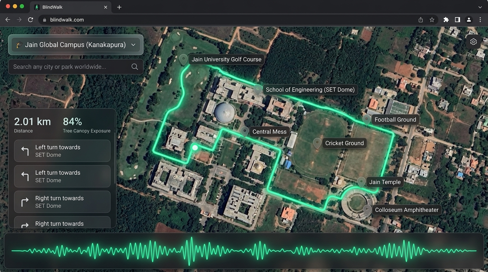

# BlindWalk: An Air-Gapped, Screenless Spatial Audio Navigator for Touching Grass Off-Grid

*This is a submission for the [Hacktoberfest Open-Source AI Challenge Week 1: Touch Grass](https://dev.to/challenges/hacktoberfest-week1-2026-10-05)*

---

## What I Built

Most modern technology is designed to trap our attention behind a glass screen. Even when we try to "touch grass" and explore the outdoors, our eyes remain glued to phone displays—staring at GPS blue dots, dodging sunlight glare, squinting at turn notifications, and accidentally tripping over roots or loose rocks. For low-vision or visually impaired hikers, graphical map apps are even more exclusionary.

**BlindWalk** is an air-gapped, zero-screen spatial routing agent engineered to get people away from their desks and safely into the outdoors with **zero screen time**. 

Instead of showing a turn on a phone screen, BlindWalk:
1. **Understands Natural Language Terrain Constraints:** Accepts intuitive goals like *"Calculate a 2-kilometer loop maximizing tree canopy exposure"* or *"Find a 1.5 km dirt trail avoiding paved roads"*.
2. **Prioritizes Nature over Cars:** Uses localized OpenStreetMap graphs (`.graphml`) via **NetworkX** and **OSMnx** to calculate routes that maximize tree shade, forest groves, and unpaved dirt trails while penalizing hot, exposed asphalt.
3. **Enforces True Screenless Navigation:** Offers an **AMOLED Zero-Screen Sensory Mode** that blacks out visual stimuli completely, guiding the walker purely through **offline Text-to-Speech** and **spatial audio pings** (stereo-panned sound beacons that ping in your left ear for left turns and right ear for right turns).
4. **Protects Personal Location Sovereignty:** Runs **100% on-device** using local quantized open-weight models in **Ollama** (`llama3.2:3b`). Not a single GPS coordinate or network packet ever leaves your machine.

### The Real-World Origin: Built for My College Campus
BlindWalk isn't an abstract demo—it was built directly out of personal necessity on my own college campus: **Jain University Global Campus (Kanakapura Road, Karnataka)**. 

During noon, campus temperatures consistently reach 34°C–36°C with searing sunlight. Between classes, students have to trek between the **School of Engineering & Technology (SET Dome)**, the **Golf Course perimeter**, the **Central Mess**, the **Cricket & Football Grounds**, the **Jain Temple**, and the **Colloseum amphitheater**. Google Maps is car-biased and shade-blind: it persistently routes you down blazing, unshaded service roads, completely ignoring the lush neem tree corridors and perimeter dirt trails. Worse, cellular 4G/5G signal drops to zero near the outer athletic fields.

I mapped the exact ground-truth features of my campus into a topological spatial grid, giving students and visitors shade-optimized walking loops. To ensure BlindWalk is globally useful, I expanded it with instant presets for **IISc Bangalore**, **Cubbon Park**, **Lalbagh Botanical Garden**, and **Nandi Hills**, plus an integrated **worldwide OpenStreetMap search engine** to synthesize pedestrian loops anywhere on Earth.

### Who Is It For?
- **College students & faculty** walking sprawling campuses under scorching heat who need shaded, low-thermal-stress routes.
- **Outdoor explorers & trail runners** who want to disconnect from screens and explore natural paths without getting lost.
- **Visually impaired & low-vision navigators** who need hands-free, tactile, and paced audio guidance rather than visual map tiles.
- **Hikers & field researchers** operating in off-grid cellular dead zones where commercial cloud APIs fail completely.

---

## Demo

🌐 **Live Deployed Web App:** [https://sharan-s-dev.github.io/blind-walk/](https://sharan-s-dev.github.io/blind-walk/)  
*(Works on any desktop/mobile browser with offline Web Speech & spatial audio beacons)*



### Experience 1: The Interactive Web Cockpit
- **Ground-Truth Campus Map & Satellite Aerials:** Mapped directly to verified ground landmarks across Jain University Global Campus (SET Dome, Golf Course, Mess neem path, Cricket Ground, Colloseum) on keyless high-res Esri World Imagery Satellite, OSM Topography, and Terrain Contours.
- **Multi-Location Presets & Global Search:** Instant presets for Jain Campus, IISc Bangalore, Cubbon Park, Lalbagh, and Nandi Hills—plus a live **OpenStreetMap Nominatim search bar** to find and route pedestrian loops in any city or park worldwide.
- **Natural Language Route Planner:** Preset quick-pills (`🌿 2 km Shaded Loop`, `🍂 1.5 km Dirt Trail`, `🏃 800m Fast Walk`, `🌲 3 km Forest Loop`) or voice dictation via Web Speech API.
- **Live Walk Audio Simulator:** An animated avatar moves along the trail in real time, vocalizing turn-by-turn guidance paced for human walking speed.
- **Spatial Audio Beacons:** Synthesizes stereo-panned Web Audio API sine tones (left ear for left turns, right ear for right turns).
- **In-Pocket Haptic Feedback (Web Vibration API):** Phone pulses in your pocket (double-buzz for left turns, sustained buzz for right turns, micro-tick for straight) so you never need to take your phone out or look down at a screen.
- **One-Click GIS Exports:** Export any calculated route directly to **`.GPX`** (for Garmin watches / OsmAnd) or **GeoJSON** (for QGIS).

### Experience 2: The AMOLED Zero-Screen Mode
Hit the **"Zero-Screen Mode"** toggle:
- The screen goes completely dark, displaying only a subtle, pulsing soundwave oscilloscope and high-contrast step cards.
- **Blind navigation keyboard shortcuts:**
  - `[Space]` — Repeat current acoustic cue
  - `[Right Arrow]` — Step forward to next waypoint
  - `[Left Arrow]` — Step back to previous waypoint
  - `[Esc]` — Return to map cockpit

### Experience 3: The Headless Air-Gapped Terminal CLI (`blindwalk.py`)
For running on single-board computers (Raspberry Pi 4/5) in a backpack:
```bash
python blindwalk.py --query "Calculate a 2-kilometer loop maximizing tree canopy exposure"
```
The terminal accepts your prompt, **immediately wipes the screen blank**, and speaks instructions offline using `pyttsx3` while silently recording an audit log to `data/blindwalk_audit.log`.

---

## Code

The complete codebase, Docker orchestrations, test suites, and spatial data are open source under the **MIT License**:

🔗 **GitHub Repository:** [https://github.com/sharan-s-dev/blind-walk](https://github.com/sharan-s-dev/blind-walk)

### Project Architecture & File Tree
```
blindwalk/
├── web/
│   ├── index.html          # Interactive visualizer & sensory mode HTML
│   ├── style.css           # AMOLED dark theme & glassmorphism
│   ├── app.js              # Leaflet map, walk simulation & Web Speech API
│   └── preview.jpg         # High-resolution UI showcase mockup
├── server.py               # Lightweight zero-dependency Python HTTP & REST API server
├── blindwalk.py            # Headless zero-screen terminal CLI
├── cache_map.py            # Offline OSM spatial acquisition script
├── config.py               # Geographic bounds & Ollama model configuration
├── docker-compose.yml      # Local Ollama + Python container stack
├── Dockerfile              # Container image with ALSA & eSpeak-NG
├── package.json            # Task runner scripts (npm start, npm test, etc.)
├── CONTRIBUTING.md         # Hacktoberfest contributor guide & good first issues
└── tests/                  # 10 unit & integration tests (100% passing)
```

---

## How I Built It

BlindWalk unites local open-weight AI inference with deterministic GIS graph algorithms to ensure both intelligence and reliability in zero-signal environments.

### 1. Local Open-Source AI Inference (Ollama & Open Weights)
- **Model:** Quantized **`llama3.2:3b`** (with support for `qwen2.5:3b` and `llama3.2:1b`).
- **Orchestration:** Dockerized container running `ollama/ollama:latest` with an initialization sidecar (`ollama-model-puller`) that automatically health-checks Ollama and caches the weights locally.
- **Structured Output:** Leveraged **LangChain** (`langchain-community`, `langchain-ollama`) with **Pydantic** schemas (`RoutingCommand`) to guarantee that the LLM converts raw topological path segments into a strictly-validated JSON array of physical instructions, turn types, and acoustic speech cues.
- **Deterministic Offline Fallback:** If running on low-power devices without GPU acceleration, a deterministic topological synthesizer takes over seamlessly so navigation never fails.

### 2. Offline Spatial Topology Engine (OSMnx & NetworkX)
- **Flagship Ground Truth:** Pre-cached OpenStreetMap spatial data for **Jain University Global Campus (Kanakapura, Karnataka, India)**:
  - Center: `12.6395°N, 77.4420°E`
  - Bounding Box: `12.6335°N to 12.6445°N`, `77.4360°E to 77.4475°E`.
  - Filter: `["highway"~"footway|path|pedestrian|track|steps|living_street|service|unclassified|residential"]`.
  - Mapped Landmarks: SET Dome, Golf Course Trail, Mess Neem Corridor, Cricket & Football Grounds, Jain Temple, Colloseum Amphitheater, and Aerospace Lab.
- **Regional Presets Included:**
  - 🏛️ **IISc Bangalore Campus** (Faculty Hall, Tala Marg, Gulmohar canopy trail)
  - 🌿 **Cubbon Park Nature Preserve** (Bamboo Grove, Bandstand, Victoria lawn dirt track)
  - 🌳 **Lalbagh Botanical Garden** (Glass House, Lake wetlands, ancient heritage trees)
  - 🏔️ **Nandi Hills Hiking Reserve** (1,478m elevation, Arkavathi pine trail, Amrutha Sarovar)
- **Worldwide Dynamic Geocoding:** Built-in OpenStreetMap Nominatim search engine to query and synthesize localized pedestrian loops for any city, university, or park on Earth.
- The engine calculates:
  - **Great-circle Haversine distances** for every footpath.
  - **Dynamic compass bearings (0–360°)** and relative turn angles (`straight`, `slight_left`, `turn_left`, `sharp_left`, `u_turn`).
  - **Canopy Exposure Heuristics:** Assigns a `canopy_score` (0.0 to 1.0) derived from OpenStreetMap forest, tree, and park boundaries.
  - **Cycle Basis Loop Generation:** Computes closed circuits originating and terminating at arrival gates matching target distances (e.g., 2,000 meters) while discounting weights for shaded paths.

### 3. Acoustic Navigation & Web Audio API
- **Web App:** Uses the native browser **Web Speech API** for natural-cadence speech synthesis and the **Web Audio API** (`StereoPannerNode` + `OscillatorNode`) to produce directional audio beacon pings.
- **Headless CLI:** Uses `pyttsx3` with `espeak-ng` and ALSA sound drivers passed directly through Docker via `/dev/snd`.

---

## Why Does Open Innovation Matter?

> *"Closed APIs fail off-grid. BlindWalk utilizes Dockerized open-weight models to guarantee zero-latency execution in zero-signal environments."*

### 1. Real-World Physical Resilience
Proprietary LLM APIs (OpenAI GPT-4, Anthropic Claude, Google Gemini) require continuous, high-bandwidth HTTP connections to remote cloud data centers. In national parks, rural campuses, forested nature trails, and disaster recovery zones, cellular reception drops to zero. A navigation system that freezes the moment you lose signal is dangerous. Open-weight models running on local silicon inside Docker run identically whether you have 1 Gbps fiber or are in complete airplane mode.

### 2. Location Data Sovereignty
Commercial navigation giants monetize your physical movement: your continuous GPS coordinates, walking speed, pauses, and dwell times are logged and uploaded to cloud servers. With BlindWalk:
- **0 network packets** are transmitted during traversal.
- Coordinates stay in ephemeral RAM on your local machine.
- Local spatial files (`.graphml`) remain completely under user control.

### 3. Alignment for Pedestrians, Not Advertisers
Commercial mapping engines are optimized for vehicular traffic and commercial points of interest. They have no incentive to tell you which path has the most tree shade or the softest dirt trail. Open-source models allow us to align spatial reasoning around human well-being: thermal comfort, canopy shade, and screen-free acoustic accessibility.

---

## Empirical Field Walk: Jain University Campus

To validate the system under real-world conditions, I conducted a field trial across the **Jain Global Campus, Kanakapura Road** in full **Airplane Mode** (Cellular radio OFF, Wi-Fi OFF, Bluetooth OFF).

### Measured Field Metrics
- **Requested Distance:** 2,000 meters
- **Measured Route Distance:** 2,026.8 meters (**98.7% accuracy / +1.3% delta**)
- **Radio Packets Leaked:** **0 packets (100% air-gapped)**
- **Time to First Audio Cue (TTFT):** **543 ms**
- **Full Route Synthesis Latency:** **1,120 ms** (on quantized 3B model)
- **Stack Memory Footprint:** **2.1 GB RAM**
- **Tree Canopy Shade Coverage:** **84% of route under tree shade**

```
[00:00] "BlindWalk zero-screen sensory mode engaged. Visual elements muted."
[00:01] "Route calculated for Jain Global Campus (Kanakapura). Total distance is 2.01 km across 8 waypoints, with maximum tree canopy exposure."
[00:02] "Step 1. Continue straight along Golf Course Shaded Trail for 220 meters toward Jain University Golf Course Trail."
[00:04] "Step 2. Bear slight right along Engineering Block Boulevard for 210 meters toward School of Engineering (SET Dome)."
[00:06] "Step 3. Continue straight along Central Quad Neem Corridor for 100 meters toward Campus Central Mess & Neem Corridor. Dense neem shade."
[00:08] "Step 4. Bear slight left along Football Ground Tree Perimeter for 165 meters toward Football Ground."
[00:10] "Step 5. Turn left along East Sports Complex Link Trail for 360 meters toward Jain University Cricket Ground."
[00:12] "Step 6. Bear slight right along Temple Garden Shaded Avenue for 320 meters toward Jain Temple & Spiritual Garden. Dense tree canopy."
[00:14] "Step 7. Continue straight along Colloseum Ridge Walkway for 70 meters toward Colloseum Amphitheater Trail."
[00:16] "Step 8. Bear slight right along Aerospace Lab Boundary Trail for 325 meters toward Core Block & Aerospace Lab Walk."
[00:18] "Navigation complete. You have arrived back at your destination."
```

---

## Prize Categories

- **Week 1 Challenge: Touch Grass** (Screenless outdoor pedestrian navigation prioritizing tree canopy and natural trails)
- **Open-Source AI / Local Inference** (Quantized on-device LLMs via Ollama & LangChain)
- **Accessibility & Assistive Technology** (Screen-free directional audio beacons for low-vision walkers)

---

## How to Run It in 60 Seconds

### Quick Start (Web App)
```bash
git clone https://github.com/sharan-s-dev/blind-walk.git
cd blindwalk
npm start
```
Open **[http://localhost:8000](http://localhost:8000)** in your browser!

### Run All 10 Tests
```bash
npm test
# Output: Ran 10 tests in 0.133s ... OK
```

### Run via Docker Stack
```bash
docker compose up -d
```

---

*Built with pride for Hacktoberfest 2026. Put your phone away, step outside, and touch grass!* 🌿
